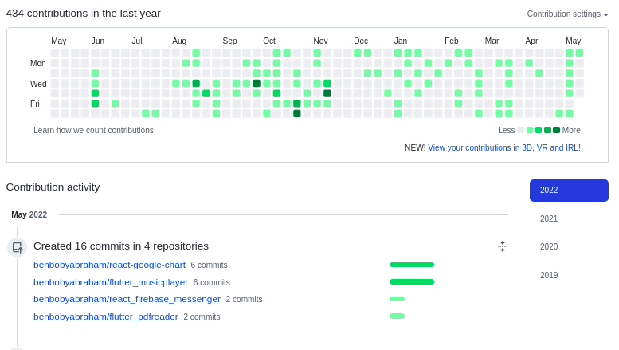

<h1 align="center">Hi 👋, I'm Ben</h1>
<h3 align="center">A passionate Data Scientist.</h3>

<a href="https://benboby.com/" target="_blank" rel="noreferrer">https://benboby.com/</a>

- 🔭 I’m currently working on Machine Learning , and Big data analysis, also DJANGO AND REACT
- 🌱 I’m currently learning application developement in FLUTTER
<!--- 👯 I’m looking to collaborate on ...
- 🤔 I’m looking for help with ...
- 💬 Ask me about ...
- 📫 How to reach me: ...
- 😄 Pronouns: ...  
- ⚡ Fun fact: ...
- 🔭 I’m currently working on something _AWESOME_
- 🌱 I'm currently learning REACT and DJANGO -->
- 📫 Reach me at benbobyabraham@gmail.com or +91-8547197319
- 📍 I'm located in Bangalore

---

 
---

---

---

 <em><b>I love connecting with different people</b> so if you want to say <b>hi, I'll be happy to catch up with you!</b> :)</em>

You are the  !

<!--  -->

<!--                           

  2 
  3 ### Elsewhere on the internet
  4 
  5 
  6 
  7 
  8 ### Popular blog posts
  9 
 10 * [15 rules for communicating at GitHub](https://ben.balter.com/2014/11/06/rules-of-communicatin    g-at-github/)
 11 * [The seven habits of highly effective GitHubbers](https://ben.balter.com/2016/09/13/seven-habi    ts-of-highly-effective-githubbers/)
 12 * [The six types of pull requests you see on GitHub](https://ben.balter.com/2015/12/08/types-of-    pull-requests/)
 13 * [Why everything should have a URL](https://ben.balter.com/2015/11/12/why-urls/)
 14 * [Why open source](https://ben.balter.com/2015/11/23/why-open-source/)
 15 * [Diff (and collaborate on) Microsoft Word documents using GitHub](https://ben.balter.com/2015/    02/06/word-diff/)
 16 
 17 ### About Ben
 18 
-->
